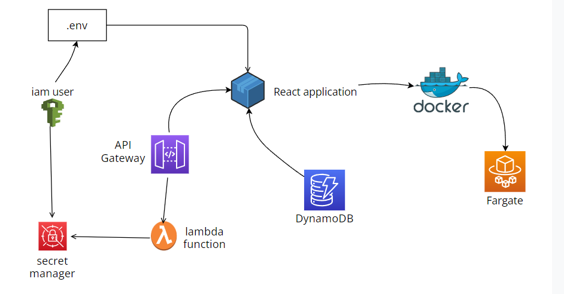

# PassGobblers

PassGobblers is a simple yet secure password manager built with React, AWS DynamoDB, and AWS Lambda. It allows you to store, retrieve, and manage your passwords securely, with encryption handled on the client-side.

## Features

- Store and retrieve passwords securely with client-side encryption.
- Search for passwords by website or username.
- Copy usernames and passwords to the clipboard with a single click.
- Generate strong random passwords.
- Responsive and modern UI.

## Prerequisites

Before you begin, ensure you have the following:

- Node.js and npm installed.
- An AWS account with DynamoDB and IAM permissions.
- Docker installed (optional, if using Fargate or Docker for deployment).
- Terraform installed (for infrastructure setup).

### Infrastructure Diagram

Below is the diagram showing the infrastructure components and their relationships:



## Installation

Clone the repository and navigate to the project directory:

```bash
git clone https://github.com/Dhruvnotfound/PASSGOBBLERS.git
cd passgobblers
```

### Option 1: Using .env File
Passing environmental variable using .env file fast but less secure

1. Create a `.env` file in the build directory.

2. Add your AWS credentials and encryption key to the `.env` file in the build folder:

   ```
   VITE_AWS_ACCESS_KEY_ID=your-access-key-id
   VITE_AWS_SECRET_ACCESS_KEY=your-secret-access-key
   ENCRYPTION_KEY=your-encryption-key
   ```

   Ensure that your encryption key is securely managed and not exposed.

### Option 2: Using API Configuration

Instead of using an `.env` file for your AWS credentials, you can configure an API or backend service to securely manage and provide these credentials.

1. Fetch the credentials and encryption key from the API in your React application:

   ```javascript
   Class DataFetcher extends React.Component {
    state = {
        items: null,
        isLoaded: false,
        error: null,
    };

    componentDidMount() {
        fetch("/api/credentials") //your api here 
        .then((res) => {
            if (!res.ok) {
            throw new Error(`HTTP error! status: ${res.status}`);
            }
            return res.json();
        })
        .then((json) => {
            this.setState({
            items: json,
            isLoaded: true,
            });
        })
        .catch((error) => {
            console.error("Error fetching data:", error);
            this.setState({ isLoaded: true, error: error.message });
        });
    }

    render() {
        const { isLoaded, items, error } = this.state;
        return this.props.children(isLoaded, items, error);
    }
   ```

2. Replace the direct references to `import.meta.env` for `VITE_AWS_ACCESS_KEY_ID`, `VITE_AWS_SECRET_ACCESS_KEY`, and `ENCRYPTION_KEY` in your code to `data`.

3. Move all the files from api-config to the terraform folder

## Dockerization
To run the PassGobblers application inside a Docker container, follow these steps:

1. Make the script provided executable 

```
chmod +x dockerhub-deploy.sh
```
2. Edit the variables according to your info 

3. Run the script 
```
.\dockerhub-deploy.sh
```

Important Notes-
```
Docker Hub Login: The docker login command will prompt you for your Docker Hub password. You can also pass it as an environment variable or use a Docker credential store.
```

4. Update the docker image name in `fargate.tf` file with your docker image name

## Infrastructure Setup
The entire infrastructure for PassGobblers is managed using Terraform, ensuring a consistent and reproducible deployment process.

### Terraform Components-
- AWS IAM: Manages user permissions and roles required for the application.
- AWS DynamoDB: The primary database for storing encrypted passwords.
- AWS Lambda: Serverless functions to interact with DynamoDB and other AWS services.
- AWS API Gateway: Exposes RESTful APIs that interact with the Lambda functions.
- AWS Secrets Manager: Securely stores the encryption key and AWS credentials (optional, if using API configuration).
- AWS Fargate: (Optional) For containerized deployment of the React application.

### Deploying the Infrastructure
Navigate to the Terraform directory directory:
```
cd terraform
```
1. Initialize Terraform:

```
terraform init
```
2. Review the Terraform plan:

```
terraform plan
```
3. Apply the Terraform plan to create the infrastructure:

```
terraform apply
```
This will deploy all necessary AWS resources, including IAM roles, DynamoDB tables, Lambda functions, and API Gateway endpoints.

4. Cleanup
```
terraform destroy --auto-approve
```

## Built With

- [React](https://reactjs.org/) - A JavaScript library for building user interfaces.
- [AWS DynamoDB](https://aws.amazon.com/dynamodb/) - A key-value and document database that delivers single-digit millisecond performance at any scale.
- [AWS Lambda](https://aws.amazon.com/lambda/) - Run code without thinking about servers.
- [Terraform](https://www.terraform.io/) - An open-source infrastructure as code software tool that provides a consistent CLI workflow to manage hundreds of cloud services.
- [Docker](https://www.docker.com/) - A platform for developing, shipping, and running applications inside containers.

## License

This project is licensed under the MIT License - see the [LICENSE](LICENSE) file for details.

---


